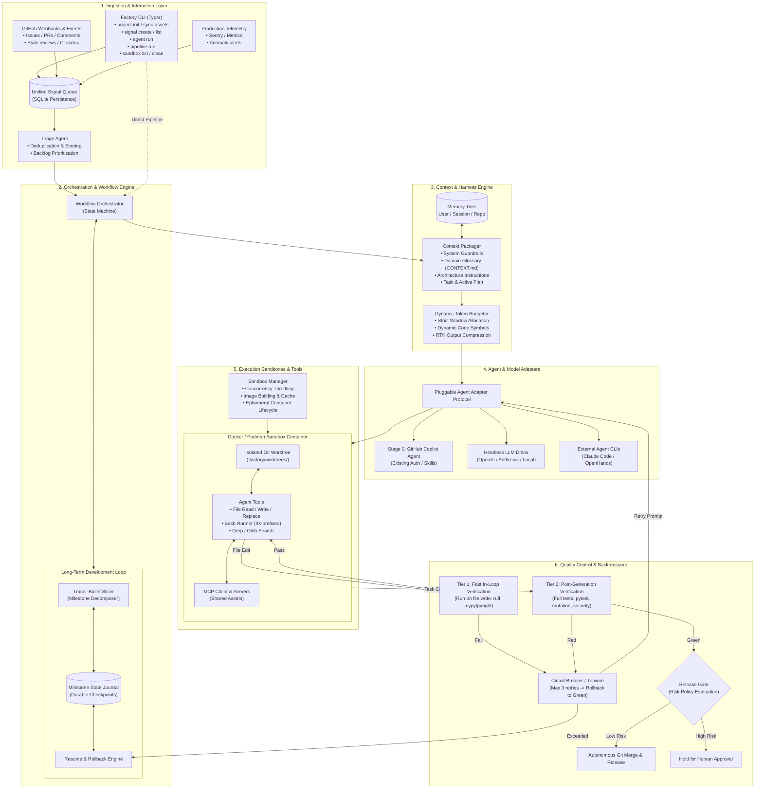

# ADR 001: Factory Core High-Level Architecture

## Status
Accepted

## Context
Factory is an autonomous AI software factory designed to automate the entire software development lifecycle: signal detection, code generation, validation, release management, documentation, and production monitoring.

Building an autonomous coding platform requires resolving several interconnected architectural challenges:
1. **Multi-project scaling & distribution:** Target projects must consume the engine cleanly without copying or diverging from core logic.
2. **Execution safety & concurrency:** Running autonomous agents on a developer's workstation or CI runner requires strict isolation to prevent destructive commands, environment contamination, and concurrent write collisions.
3. **Context engineering & token limits:** Unstructured context causes prompt bloat, performance degradation, and token exhaustion.
4. **Agent control & backpressure:** Without deterministic feedback loops, agents produce non-compiling code or enter infinite retry loops.
5. **Multi-session continuity:** Real-world initiatives span multiple sessions, requiring checkpointing, recovery, and long-term development loops.
6. **Self-hosting bootstrap:** The factory must be capable of building and evolving itself starting from a minimal seed.

## Global Architecture Schema

## Core Decisions & Subsystems

### 1. Distribution & Package Layout
- **Framework Package:** Factory is distributed as a standard Python package (`src/` layout managed by `uv`) and exposed via a domain-centric `typer` CLI.
- **Repository Boundary:** The primary repository houses Factory Core, tooling, and test harnesses. Target projects (including reference implementations such as MLOps) are managed as downstream consumers initialized and operated by the Factory.
- **Bootstrapper & Archetypes:** `factory project init` generates target projects using standardized archetypes, scaffolding dependency manifests, sandbox definitions, CI workflows, and Factory configurations.

### 2. Execution Model: Dual Operation
- **Standalone Agent Adapter:** Individual agent tasks can be invoked directly from CLI (`factory agent run <name>`) for interactive or targeted developer tasks without orchestrator overhead.
- **Workflow Orchestrator:** An event-driven state machine coordinates autonomous multi-stage pipelines: Signal Triage $\to$ Code Generation $\to$ Validation $\to$ Release Gate.

### 3. Containerized Execution Sandboxes
- **Ephemeral Sandbox Containers:** All agent activity, tool calls, and command runs are confined to dedicated Docker containers built from project-defined specifications.
- **Concurrency & Resource Control:** A Sandbox Manager limits simultaneous active containers, prevents memory/CPU host exhaustion, and isolates concurrent agent tasks in dedicated Git worktrees.
- **Host Untouched:** Host filesystem and git working tree remain pristine during agent tasks.

### 4. Context & Harness Engineering
- **Token-Budgeted Context Packaging:** The engine dynamically sizes prompt context within a strict token budget. Prioritization hierarchy:
  1. Base behavioral guardrails & identity
  2. Domain glossary (`CONTEXT.md`) and architecture rules
  3. Task instructions & active session plan
  4. Dynamically retrieved symbols, AST snippets, and diffs (fills remaining budget)
- **Token Compression:** CLI and tool outputs are compressed and filtered via `rtk` proxies.
- **Shared Assets:** Common `AGENTS.md`, MCP servers, skills, and subagents are maintained centrally in Factory Core and synchronized to target projects via `factory sync-assets` while preserving local user override directories.

### 5. Graduated Verification & Backpressure Loop
- **Tier 1 (In-Loop Checks):** Triggered immediately upon file writes inside the sandbox. Runs rapid syntax validation, formatting (`ruff`), and type analysis (`mypy`/`pyright`). Errors are returned as tool feedback for instant correction.
- **Tier 2 (Post-Generation Checks):** Triggered upon task completion declaration. Runs full pytest suites, integration checks, mutation coverage, and security audits.
- **Circuit Breaker:** Limits consecutive self-correction retries (max 3). If breached, execution halts, the sandbox reverts to the last verified green Git checkpoint, and human review is requested.

### 6. Long-Term Development & Tracer-Bullet Checkpoints
- **Tracer-Bullet Slicing:** Long initiatives are decomposed into small, independently testable vertical slices.
- **Durable Checkpoint Journal:** A persistent state journal records progress, test states, and plans.
- **Context Refreshing:** Each slice starts in a fresh context window to prevent reasoning degradation. Completed slices are committed to Git with green test suites.

### 7. Unified Signal Queue & Risk-Tiered Release Gates
- **Unified Ingestion:** Heterogeneous triggers (GitHub webhooks, monitoring alerts, manual CLI inputs) normalize into an SQLite-backed `Signal` queue triaged by an autonomous agent.
- **Risk-Tiered Promotion:** Validated changes are evaluated against configurable risk policies. Low-risk changes (docs, non-breaking patch deps with passing tests) auto-merge; high-risk modifications (domain core, schemas, infra) block at human approval checkpoints.

### 8. Self-Hosting Bootstrapping Strategy
- **Stage 0 Seed:** A minimal manual Python baseline provides the CLI skeleton, Sandbox Manager, Verification Hooks, and a default **GitHub Copilot Agent** adapter.
- **Stage 1 Autonomous Dogfooding:** Factory uses its own CLI, sandboxes, and Copilot runner to ingest future backlog signals and autonomously implement subsequent Factory Core capabilities.

## Consequences

### Positive
- **Complete Environment Safety:** Host machine is insulated from arbitrary agent command execution and filesystem edits.
- **Reproducible Engineering Standards:** Shared skills, instructions, MCP configs, and verification hooks guarantee uniform development quality across all projects.
- **Elimination of Runaway Loops:** Two-tier backpressure and circuit breakers constrain token consumption and prevent infinite failure cycles.
- **Interruptible Long-Term Work:** Multi-session tasks survive interruptions and context window resets through durable milestone checkpointing.
- **Dogfooded Evolution:** Self-hosting ensures Factory is tested daily against real development challenges.

### Negative & Trade-offs
- **Container Dependency:** Requires a running container daemon (Docker/Podman) on the host machine.
- **Initial Setup Latency:** Spawning ephemeral containers incurs a slight overhead compared to direct in-process host execution.
- **Discipline Required for Stage 0:** Developers must strictly limit manual coding to the bare minimum seed before delegating development to the Factory loop.
